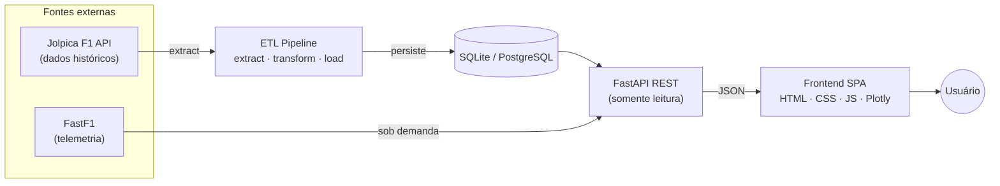
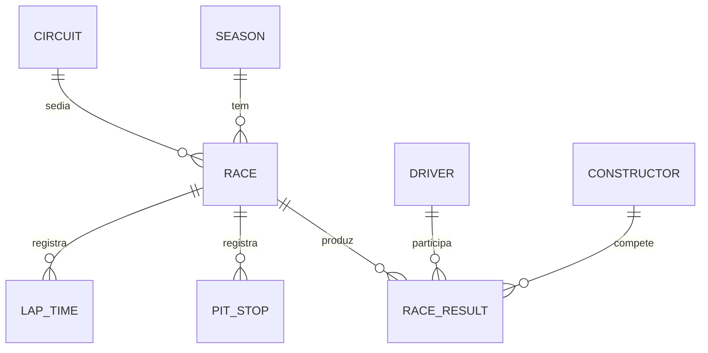

# Arquitetura — F1 Insights Engine

Documento de referência da arquitetura do projeto: como os dados fluem da fonte
externa até o dashboard, quais são as camadas e por que cada decisão técnica foi
tomada.

---

## Visão geral

O **F1 Insights Engine** é uma plataforma analítica de dados de Fórmula 1 construída
em **arquitetura orientada a serviços**, com separação clara entre **ingestão** de
dados (offline) e **leitura** (online). Os dados históricos são extraídos de uma API
pública, normalizados por um pipeline ETL, persistidos em banco relacional e expostos
por uma API REST que alimenta um dashboard SPA.

Princípio central: **o dashboard lê de um banco já populado — não baixa tudo da fonte
a cada acesso.** A telemetria detalhada (FastF1) é a única exceção, processada sob
demanda.

---

## Diagrama de alto nível

---

## Camadas e responsabilidades

| Camada | Diretório | Responsabilidade |
| ------ | --------- | ---------------- |
| **Ingestão (ETL)** | `src/etl/` | Extrair da API, transformar para o schema e carregar no banco de forma idempotente |
| **Persistência** | `src/db/` | Modelos ORM (SQLAlchemy async) e configuração de engine (SQLite ou PostgreSQL) |
| **API** | `src/api/` | Endpoints REST somente-leitura + endpoint de telemetria (FastF1) |
| **Apresentação** | `src/web/` | SPA nativa que consome a API e renderiza gráficos interativos (Plotly) |

### Ingestão (ETL)

Pipeline em três etapas bem separadas (Single Responsibility):

- **Extract** — busca paginada na API com *rate limiting* e *retry* com *backoff*
  exponencial.
- **Transform** — converte o JSON aninhado da API em dicionários planos alinhados ao
  schema do banco, com conversões seguras de tipos.
- **Load** — inserção **idempotente** (registros existentes são ignorados por chave
  natural), usando *caches* de lookup em memória para resolução de chaves estrangeiras
  e evitar o padrão N+1.

A orquestração (`run_pipeline`) aceita argumentos de linha de comando para seleção de
temporadas e carga opcional de tempos de volta (alto volume).

### Persistência

SQLAlchemy assíncrono, com troca entre **SQLite** (desenvolvimento) e **PostgreSQL**
(produção) por variável de ambiente. O schema cobre **12 entidades** do domínio de F1.

### API

FastAPI assíncrono, com endpoints **somente leitura** (GET), validação e serialização
via Pydantic, paginação/filtros e documentação automática (Swagger). Um endpoint
dedicado expõe telemetria detalhada via FastF1.

### Apresentação

SPA em HTML/CSS/JS puro (sem framework), com roteamento próprio e gráficos via Plotly
(carregado por CDN). Organizada em sete telas analíticas (visão geral, telemetria,
evolução, head-to-head, pit stops, grid e histórico).

---

## Modelo de dados (entidades principais)

> O domínio completo possui 12 entidades: temporadas, circuitos, pilotos, construtores,
> corridas, resultados, classificação (qualifying), sprint, classificações de pilotos e
> de construtores, pit stops, tempos de volta e status de finalização.

---

## Decisões técnicas

| Decisão | Escolha | Justificativa |
| ------- | ------- | ------------- |
| **Frontend** | HTML/CSS/JS puro | Performático, zero build, controle total do design |
| **API** | FastAPI + Uvicorn | Async nativo, tipagem forte (Pydantic), docs automáticas |
| **ORM** | SQLAlchemy async | Abstrai SQLite/PostgreSQL e mantém o código de banco agnóstico |
| **Banco (dev/prod)** | SQLite ↔ PostgreSQL | Zero config localmente; robustez em produção, via env var |
| **Carga** | ETL idempotente | Reexecutável com segurança; *caches* de FK evitam N+1 |
| **Telemetria** | FastF1 | Biblioteca de referência para *live timing* oficial da F1 |

---

## Fonte de dados

- **[Jolpica F1 API](https://github.com/jolpica/jolpica-f1)** — sucessora da Ergast;
  dados históricos de F1 (1950–presente).
- **[FastF1](https://docs.fastf1.dev/)** — telemetria detalhada (velocidade, freio,
  marcha, RPM, acelerador, DRS) e dados de sessão, disponíveis a partir de 2018.

---

## Direção da evolução

A arquitetura está evoluindo para um modelo de hospedagem gerenciada, mantendo a
mesma separação entre ingestão e leitura:

- **Banco** → **Supabase** (PostgreSQL gerenciado), com leitura direta pelo frontend
  via API automática e regras de acesso somente-leitura.
- **Deploy** → **Vercel** para o frontend estático.
- **Telemetria** → serviço dedicado, com cache dos resultados para acelerar acessos
  repetidos.
- **Ingestão** → agendada via CI, mantendo o banco atualizado de forma automática.
