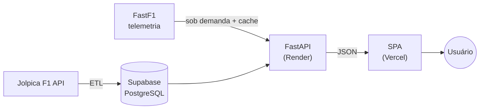

# F1 Insights Engine


Plataforma analítica de dados históricos e telemetria da Fórmula 1, em arquitetura orientada a serviços: pipeline ETL em Python, API REST assíncrona (FastAPI) e dashboard SPA nativo em HTML/CSS/JS (Plotly) com tema Cyber-Racing HUD.

## Demo ao vivo

- **Dashboard:** https://f1-insights-engine.vercel.app
- **API (Swagger):** https://f1-engine-api.onrender.com/docs

> A API roda no plano gratuito do Render, que hiberna após inatividade. O primeiro acesso fora do horário ativo pode levar ~30s para "acordar"; depois fica rápido.

---

## Arquitetura



- **Ingestão (ETL):** extrai da Jolpica F1 API, normaliza e carrega no Supabase de forma idempotente.
- **Banco:** Supabase (PostgreSQL gerenciado) em produção; SQLite por padrão localmente.
- **API:** FastAPI assíncrono no Render, somente leitura, com telemetria FastF1 memoizada no Supabase.
- **Frontend:** SPA estática no Vercel; a URL da API é resolvida por ambiente (`config.js`) e as requisições de cada tela são paralelizadas.

---

## Estrutura

```
├── src/
│   ├── api/                 # FastAPI: rotas, schemas, telemetria + cache
│   ├── db/                  # SQLAlchemy async: models ORM + engine
│   ├── etl/                 # Pipeline ETL (extract / transform / load)
│   └── web/                 # SPA: index.html, css/, js/ (app.js, config.js, lib/)
├── tests/                   # pytest (backend)
├── e2e/                     # Playwright (E2E) + servidor estático
├── .github/workflows/       # CI + keep-alive
├── render.yaml              # Blueprint de deploy (Render)
├── requirements.txt         # dependências de runtime (versões pinadas)
└── requirements-dev.txt     # dependências de teste e lint
```

---

## Rodar localmente

Pré-requisitos: Python 3.12+ e Node 20+ (para os testes de frontend).

```bash
# 1. Dependências
pip install -r requirements-dev.txt   # runtime + testes
npm install                           # toolchain de frontend (Vitest/Playwright)

# 2. Variáveis de ambiente (por padrão usa SQLite; aponte DATABASE_URL p/ Supabase se quiser)
cp .env.example .env

# 3. Popular o banco via ETL (escolha os anos; a Jolpica tem rate-limit)
python -m src.etl.run_pipeline --years 2023 2024 2025

# 4. API (terminal 1) — Swagger em /docs
python -m uvicorn src.api.main:app --reload --port 8000

# 5. Frontend (terminal 2) — http://localhost:3000
cd src/web && python -m http.server 3000
```

---

## Testes

```bash
pytest               # backend (pytest + cobertura)
npm run test         # frontend unitário (Vitest)
npm run test:e2e     # E2E das 7 telas (Playwright)
```

A cada push/PR, o **CI (GitHub Actions)** roda lint (ruff) + pytest (cobertura mínima de 80%) + Vitest.

---

## Segurança

- **Secrets:** `.env` nunca é commitado (ver `.env.example`); a connection string vive só no backend.
- **SQL Injection:** SQLAlchemy ORM com queries parametrizadas.
- **XSS:** `escapeHTML()` em toda injeção de dados da API no DOM.
- **CORS:** API somente `GET`/`OPTIONS`, restrita ao domínio do frontend.

---

Desenvolvido por [Bruno Krieger](https://github.com/BsKrieger) como projeto de portfólio.
